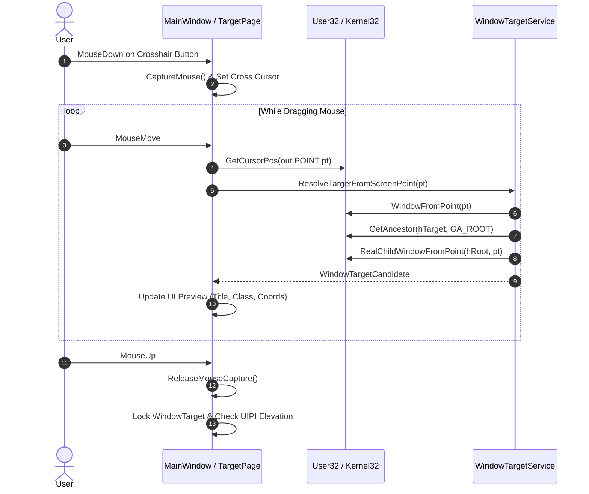
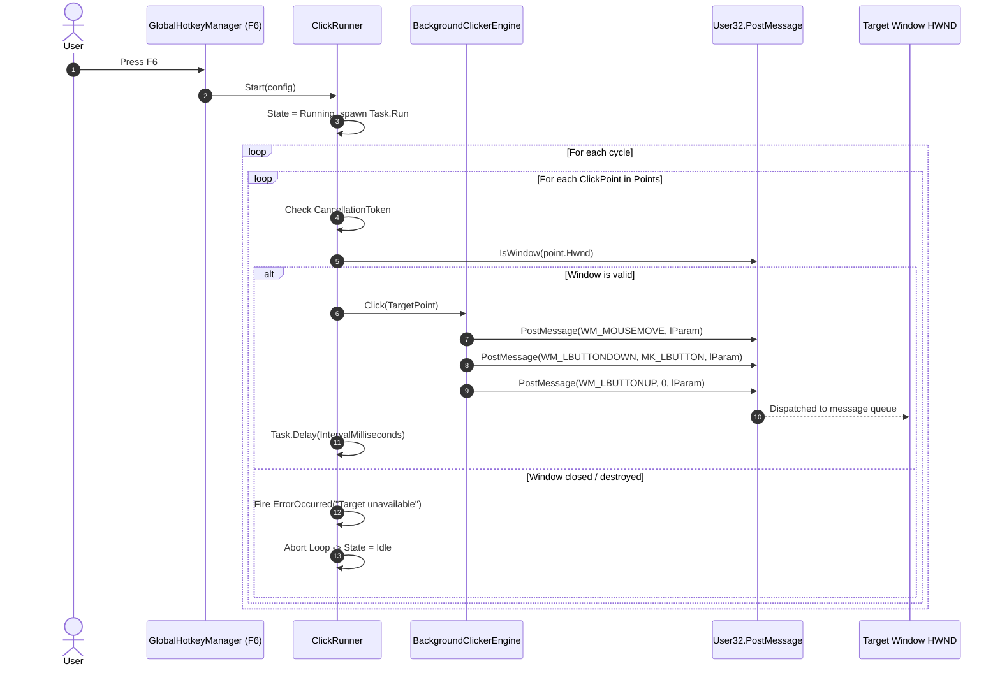
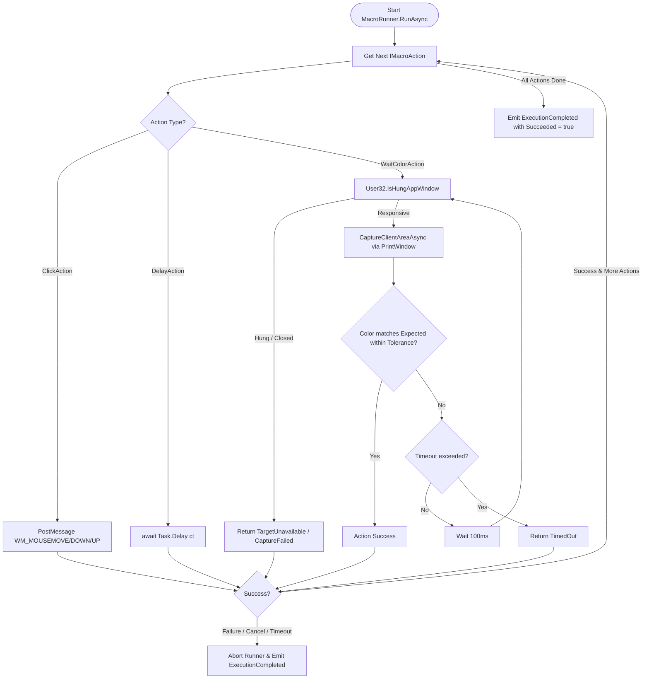
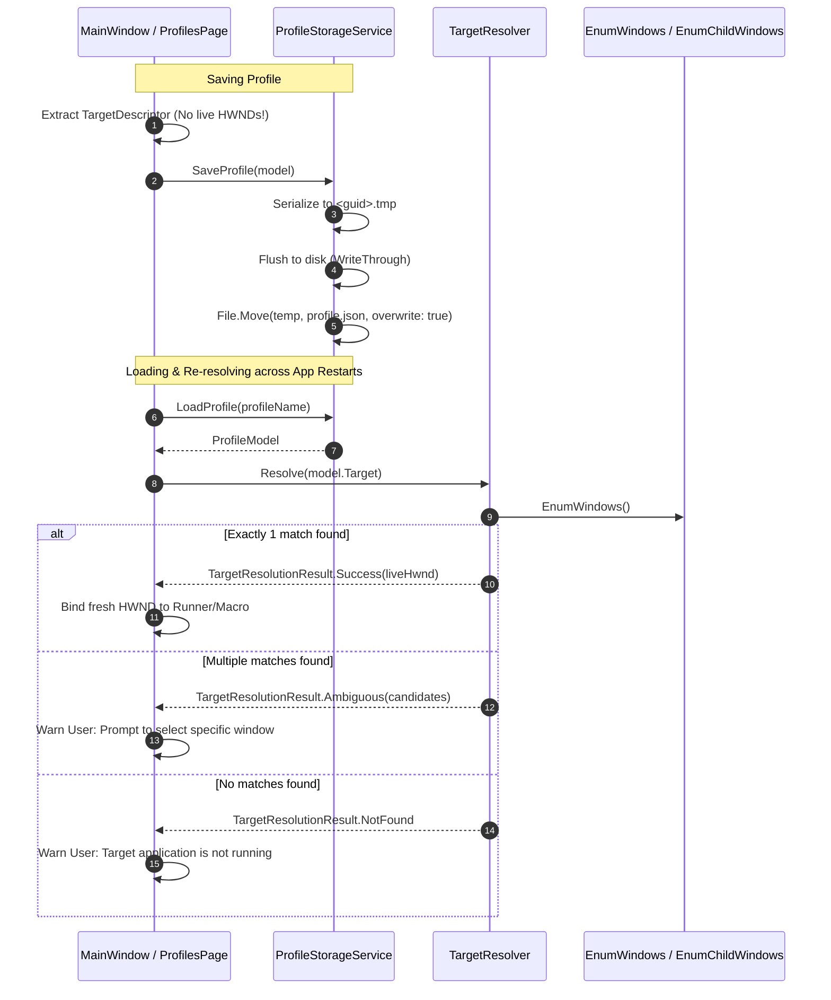

# BackgroundClicker — System Architecture, Logic & Agent Guide

> **Document Purpose**: This document serves as the authoritative technical reference and architectural specification for the BackgroundClicker codebase. It is designed so that any AI agent or software engineer can read it and immediately understand the entire system architecture, subsystem mechanics, design invariants, data flows, and code conventions.

---

## 1. Executive Summary & Core Philosophy

**BackgroundClicker** is a high-reliability Windows desktop utility built on **.NET 8 (C#)** and **WPF (Fluent Design)**, designed to inspect, target, and automate mouse clicks and macros on background or foreground application windows **without moving or hijacking the user's physical mouse cursor**.

### Fundamental Philosophy & Non-Negotiable Invariants
1. **Zero Physical Cursor Interference**: The application never calls `SetCursorPos` or `mouse_event` / `SendInput` to move the physical hardware cursor. All automation messages are injected directly into the target window's Win32 message queue via unmanaged `PostMessage`.
2. **HWND-Bound Client Coordinates**: Screen coordinates are volatile and break when windows move or resize. In BackgroundClicker, all click and capture coordinates are strictly client coordinates bound to a specific window handle (`HWND`), where `(0, 0)` is the top-left corner of that specific control's client area.
3. **Deepest Useful Child Target**: Rather than dispatching clicks to a top-level window and guessing where internal controls sit, BackgroundClicker recursively resolves the deepest child control HWND (e.g. button inside a panel inside a form).
4. **No Ephemeral Live HWNDs in Persistent Storage**: Window handles (`HWND`) are ephemeral operating system pointers that change every time an application restarts. Persistent profiles store durable **Target Descriptors** (Process Name, Window Class, Window Title, Title Match Mode, and Child Control Descriptors). Fresh HWNDs are dynamically re-resolved at runtime.
5. **Strict GDI Resource Lifecycle**: All GDI device contexts, bitmaps, and selected objects created during background client-area captures are tracked and freed in reverse order of creation inside guarded `finally` blocks, preventing resource and handle leaks.

---

## 2. High-Level System Architecture & Solution Layering

The solution follows a strict, unidirectional layered architecture:

```
┌─────────────────────────────────────────────────────────────┐
│                  BackgroundClicker.App                      │
│   (WPF Fluent UI, MVVM ViewModels/Views, Hotkeys)           │
└──────────────────────────────┬──────────────────────────────┘
                               │ references
┌──────────────────────────────▼──────────────────────────────┐
│                  BackgroundClicker.Core                     │
│  (Targeting, Coordinates, Clicking, Runners, Macro Engine,  │
│   Window Capture, Profiles & Persistence, Security/UIPI)    │
└──────────────────────────────┬──────────────────────────────┘
                               │ references
┌──────────────────────────────▼──────────────────────────────┐
│                  BackgroundClicker.Win32                    │
│    (Centralized P/Invoke: User32, Gdi32, Kernel32, Advapi32,│
│     Native Constants, Structs, Message Packing Helpers)     │
└─────────────────────────────────────────────────────────────┘

                  ┌────────────────────────┐
                  │    Test Ecosystem      │
                  ├────────────────────────┤
                  │ BackgroundClicker.     │
                  │   TestTarget (WinForms)│
                  │ BackgroundClicker.     │
                  │   Tests (xUnit / 140+) │
                  └────────────────────────┘
```

### Dependency Rules:
- **`BackgroundClicker.Win32`** has **zero** dependencies on other solution projects. All native Win32 API declarations, structures (`POINT`, `RECT`), and flags live here. No other project may contain raw `[DllImport]` declarations.
- **`BackgroundClicker.Core`** depends only on `BackgroundClicker.Win32`. It contains pure domain logic, background worker loops, serialization models, and abstractions. It has **no dependency** on `BackgroundClicker.App` or WinForms UI controls.
- **`BackgroundClicker.App`** depends on `BackgroundClicker.Core` and `BackgroundClicker.Win32`. It hosts the WPF Fluent views, MVVM view models, data binding, and global keyboard hotkeys.
- **`BackgroundClicker.TestTarget`** is an isolated, deterministic WinForms harness exposing verifiable controls, click counters, color panels, and a raw Windows message logger.
- **`BackgroundClicker.Tests`** executes automated unit and integration tests against Core and real spawned processes of `TestTarget`.

---

## 3. Subsystem Breakdown & Implementation Details

```
src/
├── BackgroundClicker.Win32/          # Native Interop Layer
├── BackgroundClicker.Core/           # Core Domain & Logic
│   ├── Capture/                      # GDI Window Capture & Color Inspection
│   ├── Clicking/                     # PostMessage Background Click Engine
│   ├── Coordinates/                  # Screen <-> Client Coordinate Translation
│   ├── Logging/                      # Diagnostic Logger Abstraction
│   ├── Macro/                        # Composable Action Engine & Runner
│   ├── Profiles/                     # Profile Schema, Serialization & Atomic Storage
│   ├── Runner/                       # Asynchronous Simple Click Runner Loop
│   ├── Security/                     # Process Elevation & UIPI Detection
│   └── Targeting/                    # Window Inspection, Resolution & Descriptors
└── BackgroundClicker.App/            # WPF Fluent Presentation Layer
    ├── Views/                        # Fluent Pages (Target, Simple, Macro, Profiles, Diag)
    ├── ViewModels/                   # CommunityToolkit MVVM ViewModels
    ├── Models/                       # Presentation-layer Models
    ├── Converters/                   # XAML Binding Converters
    ├── Services/                     # Navigation & Page Service
    └── Hotkeys/                      # System-wide Win32 Global Hotkeys (F6/F7)
```

### 3.1. Win32 Native Interop Layer (`BackgroundClicker.Win32`)

Centralizes all unmanaged interop definitions and low-level bitwise helpers:
- **[User32.cs](file:///d:/personal-project/background-clicker/src/BackgroundClicker.Win32/User32.cs)**: Window enumeration (`EnumWindows`, `EnumChildWindows`), hierarchy inspection (`GetParent`, `GetAncestor`, `WindowFromPoint`, `RealChildWindowFromPoint`), coordinates (`ScreenToClient`, `ClientToScreen`, `GetClientRect`), messaging (`PostMessage`, `SendMessage`), capture (`PrintWindow`, `GetDC`, `ReleaseDC`, `IsHungAppWindow`), hotkeys (`RegisterHotKey`, `UnregisterHotKey`), DPI (`SetProcessDpiAwarenessContext`, `GetDpiForWindow`), and DWM (`DwmGetWindowAttribute` for `DWMWA_CLOAKED`).
- **[Gdi32.cs](file:///d:/personal-project/background-clicker/src/BackgroundClicker.Win32/Gdi32.cs)**: `CreateCompatibleDC`, `CreateCompatibleBitmap`, `SelectObject`, `DeleteObject`, `DeleteDC`.
- **[Kernel32.cs](file:///d:/personal-project/background-clicker/src/BackgroundClicker.Win32/Kernel32.cs)**: Process querying (`OpenProcess`, `CloseHandle`), thread information, error codes.
- **[Advapi32.cs](file:///d:/personal-project/background-clicker/src/BackgroundClicker.Win32/Advapi32.cs)**: Token security queries (`OpenProcessToken`, `GetTokenInformation`).
- **[MouseMessageHelper.cs](file:///d:/personal-project/background-clicker/src/BackgroundClicker.Win32/MouseMessageHelper.cs)**:
  - Packs signed 16-bit coordinates into a 32-bit `LPARAM`:
    ```csharp
    uint low = (ushort)(short)x;
    uint high = (ushort)(short)y;
    return unchecked((IntPtr)(int)(low | (high << 16)));
    ```
  - Unpacks signed 16-bit coordinates safely preserving negative monitor spaces:
    ```csharp
    int x = unchecked((short)((long)lParam & 0xFFFF));
    int y = unchecked((short)(((long)lParam >> 16) & 0xFFFF));
    ```
- **[NativeTypes.cs](file:///d:/personal-project/background-clicker/src/BackgroundClicker.Win32/NativeTypes.cs)**: Value-type structs `POINT` and `RECT` with implicit conversions to/from `System.Drawing.Point` and `System.Drawing.Rectangle`.

---

### 3.2. Targeting Subsystem (`BackgroundClicker.Core.Targeting`)

Responsible for discovering, inspecting, and resolving target windows.

#### Core Models & Services:
1. **[TargetPoint](file:///d:/personal-project/background-clicker/src/BackgroundClicker.Core/Targeting/TargetPoint.cs)**:
   - Immutable record pairing `IntPtr Hwnd`, `int ClientX`, and `int ClientY`.
   - Invariant: A coordinate point is meaningless without its associated window handle.
2. **[WindowTarget](file:///d:/personal-project/background-clicker/src/BackgroundClicker.Core/Targeting/WindowTarget.cs)**:
   - Rich snapshot of a live target: `RootHwnd`, `TargetHwnd`, `ParentHwnd`, `ProcessId`, `ThreadId`, `ProcessName`, `WindowTitle`, `WindowClass`, `ScreenBounds`, `ClientBounds`.
   - Computes friendly display names for the UI.
3. **[WindowTargetService](file:///d:/personal-project/background-clicker/src/BackgroundClicker.Core/Targeting/WindowTargetService.cs)**:
   - `EnumerateTopLevelWindows`: Uses `User32.EnumWindows` to find visible, uncloaked windows with non-empty titles.
   - `ResolveTargetFromScreenPoint(POINT screenPoint)`:
     - Uses `User32.WindowFromPoint` to find the window under the cursor.
     - Resolves the root top-level window via `User32.GetAncestor(GA_ROOT)`.
     - Recursively drills down via `User32.RealChildWindowFromPoint` and `ChildWindowFromPointEx` to locate the deepest nested child control (button, edit box, panel) at that screen coordinate.
4. **[TargetDescriptor](file:///d:/personal-project/background-clicker/src/BackgroundClicker.Core/Targeting/TargetDescriptor.cs)** & **`ChildTargetDescriptor`**:
   - The persistent representation of a target.
   - Captures `ProcessName`, `WindowTitle`, `WindowClass`, `TitleMatchMode` (`Exact`, `Contains`, `StartsWith`, `Any`), and optional child control selectors (`ControlClass`, `ControlText`, `ControlIndex`).
   - Guarantees zero live HWND storage.
5. **[TargetResolver](file:///d:/personal-project/background-clicker/src/BackgroundClicker.Core/Targeting/TargetResolver.cs)**:
   - Resolves a `TargetDescriptor` back into a live `TargetResolutionResult`.
   - **Ambiguity Detection**: If multiple running top-level windows match the criteria, returns `TargetResolutionStatus.Ambiguous` with the list of candidates, preventing accidental click dispatch to the wrong window.
   - If a child descriptor is present, uses `User32.EnumChildWindows` to find and index matching child controls.
6. **[HwndFormatter](file:///d:/personal-project/background-clicker/src/BackgroundClicker.Core/Targeting/HwndFormatter.cs)**:
   - Formats `IntPtr` as an explicit 16-character 64-bit hex string (`0x00000000001203AA`), preventing 32-bit truncation errors on x64 platforms.

---

### 3.3. Coordinate Subsystem (`BackgroundClicker.Core.Coordinates`)

- **[CoordinateService](file:///d:/personal-project/background-clicker/src/BackgroundClicker.Core/Coordinates/CoordinateService.cs)**:
  - Translates between global screen coordinates and window client coordinates via `User32.ScreenToClient` and `User32.ClientToScreen`.
  - Verifies coordinate round-trip consistency (`Screen -> Client -> Screen`).
  - Correctly supports multi-monitor setups where secondary monitors sit at negative virtual desktop coordinates (e.g. `X = -1920, Y = -1080`).
- **DPI Awareness**:
  - Configured at the operating system manifest level (`app.manifest`) as `PerMonitorV2`.
  - Initialized in `Program.cs` before any UI creation via `Application.SetHighDpiMode(HighDpiMode.PerMonitorV2)` and `User32.SetProcessDpiAwarenessContext`.

---

### 3.4. Background Clicking Engine (`BackgroundClicker.Core.Clicking`)

- **[IBackgroundClicker](file:///d:/personal-project/background-clicker/src/BackgroundClicker.Core/Clicking/IBackgroundClicker.cs)**: Contract defining `Click(TargetPoint)` and `DoubleClick(TargetPoint)`.
- **[BackgroundClickerEngine](file:///d:/personal-project/background-clicker/src/BackgroundClicker.Core/Clicking/BackgroundClickerEngine.cs)**:
  - Validates `User32.IsWindow(target.Hwnd)`.
  - Encodes `(ClientX, ClientY)` into `lParam` using `MouseMessageHelper.MakeMouseLParam`.
  - Dispatches non-blocking asynchronous messages using `User32.PostMessage`:
    - **Single Click Sequence**:
      1. `WM_MOUSEMOVE` (`wParam = 0`, `lParam`)
      2. Pacing delay (if configured via `MessagePacingMilliseconds`)
      3. `WM_LBUTTONDOWN` (`wParam = MK_LBUTTON`, `lParam`)
      4. Pacing delay
      5. `WM_LBUTTONUP` (`wParam = 0`, `lParam`)
    - **Double Click Sequence**:
      1. `WM_MOUSEMOVE`
      2. `WM_LBUTTONDOWN` (`MK_LBUTTON`)
      3. `WM_LBUTTONUP` (0)
      4. `WM_LBUTTONDBLCLK` (`MK_LBUTTON`)
      5. `WM_LBUTTONUP` (0)
  - **Why `PostMessage` instead of `SendMessage`?**: `SendMessage` blocks the calling thread synchronously until the target window's message pump processes the message. If the target window is hung, busy, or displaying a modal dialog, `SendMessage` would freeze the automation engine. `PostMessage` posts to the target queue asynchronously and returns immediately.

---

### 3.5. Simple Click Runner Subsystem (`BackgroundClicker.Core.Runner`)

- **[ClickRunner](file:///d:/personal-project/background-clicker/src/BackgroundClicker.Core/Runner/ClickRunner.cs)**:
  - Manages sequential execution of an ordered list of `ClickPoint`s.
  - Thread-safe lifecycle state machine:
    $$\text{Idle} \xrightarrow{\text{Start()}} \text{Running} \xrightarrow{\text{Stop()}} \text{Stopping} \rightarrow \text{Idle}$$
  - Execution runs on a background worker task (`Task.Run`).
  - Controlled by a `CancellationTokenSource`.
  - Supports two repeat modes (`RepeatMode`):
    - `UntilStopped`: Repeats the sequence infinitely until the user presses Stop or F6/F7.
    - `Count`: Repeats the sequence for a fixed number of cycles.
  - Inter-cycle and inter-point delays implemented with non-blocking `Task.Delay(ms, token)`.
  - Detects target closure during execution: if `User32.IsWindow(target.Hwnd)` becomes false, fires `ErrorOccurred` and terminates cleanly.

---

### 3.6. Macro Engine Subsystem (`BackgroundClicker.Core.Macro`)

A composable, sequential pipeline for multi-step automation tasks:

```
┌────────────────────────────────────────────────────────┐
│                      MacroRunner                       │
│    (Sequential Execution, Linked CancellationToken,    │
│     Lifecycle State, Action Events & Timing)           │
└──────────────────────────┬─────────────────────────────┘
                           │ executes actions sequentially
   ┌───────────────────────┼─────────────────────────┐
   │                       │                         │
┌──▼──────────┐     ┌──────▼──────┐          ┌───────▼────────┐
│ ClickAction │     │ DelayAction │          │ WaitColorAction│
│ DoubleClick │     │ (Task.Delay)│          │ (GDI Capture + │
│   Action    │     │             │          │  Color Match)  │
└─────────────┘     └─────────────┘          └────────────────┘
```

#### Core Classes:
- **[IMacroAction](file:///d:/personal-project/background-clicker/src/BackgroundClicker.Core/Macro/IMacroAction.cs)**:
  - Base interface requiring `ExecuteAsync(MacroExecutionContext context, CancellationToken ct)`.
- **[MacroExecutionContext](file:///d:/personal-project/background-clicker/src/BackgroundClicker.Core/Macro/MacroExecutionContext.cs)**:
  - Dependency bag injected into each action: `IBackgroundClicker Clicker`, `IWindowCaptureService CaptureService`, and `IntPtr TargetHwnd`.
- **[MacroActionResult](file:///d:/personal-project/background-clicker/src/BackgroundClicker.Core/Macro/MacroActionResult.cs)**:
  - Status enum `MacroActionStatus`: `Success`, `Failed`, `TimedOut`, `Cancelled`, `TargetUnavailable`, `CaptureFailed`.
- **Macro Actions**:
  - **[ClickAction](file:///d:/personal-project/background-clicker/src/BackgroundClicker.Core/Macro/ClickAction.cs)**: Executes single click at `(X, Y)`.
  - **[DoubleClickAction](file:///d:/personal-project/background-clicker/src/BackgroundClicker.Core/Macro/DoubleClickAction.cs)**: Executes double click at `(X, Y)`.
  - **[DelayAction](file:///d:/personal-project/background-clicker/src/BackgroundClicker.Core/Macro/DelayAction.cs)**: Non-blocking asynchronous delay.
  - **[WaitColorAction](file:///d:/personal-project/background-clicker/src/BackgroundClicker.Core/Macro/WaitColorAction.cs)**:
    - Repeatedly captures client area via `CaptureService.CaptureClientAreaAsync`.
    - Samples pixel at client coordinates `(X, Y)`.
    - Compares with `ExpectedColor` using per-channel RGB `Tolerance`:
      $$|R_1 - R_2| \le T \land |G_1 - G_2| \le T \land |B_1 - B_2| \le T$$
    - Polls at configurable interval (default 100ms) until match or `TimeoutMilliseconds` expires.
    - If target window closes, returns `TargetUnavailable`.
    - If capture fails (e.g. target hung), returns `CaptureFailed`.
- **[MacroRunner](file:///d:/personal-project/background-clicker/src/BackgroundClicker.Core/Macro/MacroRunner.cs)**:
  - Orchestrates execution of `IReadOnlyList<IMacroAction>`.
  - Supports linked external cancellation tokens.
  - Short-circuits immediately if an action fails, cancels, or times out.
  - Fires fine-grained events: `StateChanged`, `ActionStarting`, `ActionCompleted`, and `ExecutionCompleted`.

---

### 3.7. Window Capture & Color Inspection Subsystem (`BackgroundClicker.Core.Capture`)

Captures the visual appearance of background windows without bringing them to the foreground.

#### Win32 Capture Pipeline:
```
GetDC(hWnd)
   └──> CreateCompatibleDC(hdcWindow)
           └──> CreateCompatibleBitmap(hdcWindow, width, height)
                   └──> SelectObject(hdcMem, hBitmap)
                           └──> PrintWindow(hWnd, hdcMem, PW_CLIENTONLY)
                                   └──> Image.FromHbitmap(hBitmap) -> managed Bitmap
```

#### Strict GDI Cleanup Order:
To avoid leaking GDI and USER handles (which causes Windows desktop crashes when hitting the 10,000 handle ceiling), cleanup is strictly ordered in nested `finally` blocks:
1. `SelectObject(hdcMem, hOldBitmap)` (Restore original unmanaged object)
2. `Gdi32.DeleteObject(hBitmap)`
3. `Gdi32.DeleteDC(hdcMem)`
4. `User32.ReleaseDC(hWnd, hdcWindow)`

#### Hardening against Hung Targets & Thread Exhaustion:
1. **Pre-Check Target Responsiveness**: `User32.IsHungAppWindow(hWnd)` is checked before initiating capture. If the target application's message pump is deadlocked, capture is aborted immediately.
2. **Worker Thread Offloading**: Captures execute off the UI thread via `Task.Run(() => CaptureClientArea(hWnd))`.
3. **Single-Flight Concurrency Gate**: A `SemaphoreSlim(1, 1)` gate with `WaitAsync(0, ct)` ensures that if a previous capture is still processing, subsequent requests are dropped rather than accumulating hundreds of queued worker threads.

---

### 3.8. Profile Persistence & Storage Subsystem (`BackgroundClicker.Core.Profiles`)

Handles saving and loading automation configurations to disk.

#### File Storage Location:
Profiles are stored as formatted JSON files in:
`%LOCALAPPDATA%\BackgroundClicker\profiles\<profile_name>.json`

#### Durable Schema ([ProfileModel.cs](file:///d:/personal-project/background-clicker/src/BackgroundClicker.Core/Profiles/ProfileModel.cs)):
```json
{
  "name": "MyAutomationProfile",
  "version": "1.0",
  "createdAt": "2026-09-23T11:00:00Z",
  "updatedAt": "2026-09-23T11:30:00Z",
  "mode": "Macro",
  "target": {
    "processName": "notepad",
    "windowTitle": "Untitled - Notepad",
    "windowClass": "Notepad",
    "titleMatchMode": "Contains",
    "childDescriptor": null
  },
  "settings": {
    "intervalMilliseconds": 1000,
    "repeatMode": "UntilStopped",
    "repeatCount": 1
  },
  "points": [],
  "macroActions": [
    {
      "actionType": "Click",
      "x": 120,
      "y": 45,
      "delayMilliseconds": 0,
      "expectedColorHex": null,
      "colorTolerance": 0,
      "timeoutMilliseconds": 0
    }
  ]
}
```

#### Atomic File Writes ([ProfileStorageService.cs](file:///d:/personal-project/background-clicker/src/BackgroundClicker.Core/Profiles/ProfileStorageService.cs)):
To prevent profile corruption during sudden application termination or power loss:
1. Serializes JSON to a unique temporary file (`<guid>.tmp`) with `FileOptions.WriteThrough`.
2. Flushes file streams to disk (`Flush(flushToDisk: true)`).
3. Atomically moves/replaces the temporary file over the target file via `File.Move(tempPath, finalPath, overwrite: true)`.
4. If an error occurs, the temporary file is deleted.
5. Damaged or corrupted JSON files in the directory are safely skipped during profile listing (`ListProfiles`) without crashing the application.

---

### 3.9. Security & UIPI Privilege Diagnostics (`BackgroundClicker.Core.Security`)

Windows enforces **User Interface Privilege Isolation (UIPI)**. Under UIPI, Windows blocks lower-integrity processes (e.g. non-elevated BackgroundClicker) from sending window messages (`WM_LBUTTONDOWN`, `WM_LBUTTONUP`) to higher-integrity processes (e.g. an application running as Administrator). The messages are silently discarded by the Windows kernel without returning an error code.

- **[ProcessElevationService](file:///d:/personal-project/background-clicker/src/BackgroundClicker.Core/Security/ProcessElevationService.cs)**:
  - Queries `WindowsIdentity.GetCurrent()` to check if BackgroundClicker is elevated.
  - Queries the target process token via `Kernel32.OpenProcess(PROCESS_QUERY_LIMITED_INFORMATION)` + `Advapi32.OpenProcessToken(TOKEN_QUERY)` + `Advapi32.GetTokenInformation(TokenElevation)`.
  - Produces an `ElevationCheckResult`:
    - `Compatible`: Both non-elevated or BackgroundClicker is elevated.
    - `UipiMismatch`: Target is Admin but BackgroundClicker is non-admin. Triggers UI warnings.
    - `Unknown`: Access denied or protected system process.
- **UI Action**:
  - The UI displays an amber warning badge when a UIPI mismatch occurs.
  - Provides a **Restart as Administrator** button that relaunches the executable with `ProcessStartInfo.Verb = "runas"`.

---

### 3.10. Application UI & Global Hotkeys (`BackgroundClicker.App`)

- **WPF Fluent Presentation Layer (`MainWindow.xaml`, `Views/`, `ViewModels/`)**:
  - Organized with Fluent sidebar navigation (`Wpf.Ui.Controls.NavigationView`): **Target**, **Click Sequence**, **Macro**, **Profiles**, and **Diagnostics**.
  - Built with lightweight MVVM using **CommunityToolkit.Mvvm** (`ObservableObject`, `[ObservableProperty]`, `[RelayCommand]`).
  - **Crosshair Drag-and-Drop Targeting**:
    - User clicks and holds the Crosshair button.
    - Captures mouse events and inspects the window underneath via `WindowTargetService.ResolveTargetFromScreenPoint` using `User32.GetCursorPos`.
    - Coordinates and candidate details are previewed in real-time.
    - When the mouse button is released, locks onto the resolved target, checks UIPI compatibility, and updates all views.
  - Persistent bottom status bar showing current target, runner status, and hotkey hints.
- **[GlobalHotkeyManager.cs](file:///d:/personal-project/background-clicker/src/BackgroundClicker.App/Hotkeys/GlobalHotkeyManager.cs)**:
  - Registers system-wide hotkeys via `User32.RegisterHotKey`:
    - **F6** (`HotkeyId = 1001`): Start / Stop active runner (Simple or Macro).
    - **F7** (`HotkeyId = 1002`): Emergency Stop (instantly halts any running loop).
  - Listens for `WM_HOTKEY` via `HwndSource` message hook in `MainWindow`.
  - Works even when BackgroundClicker is minimized or another application has focus.
  - Gracefully handles conflicts if another application has already registered F6 or F7.

---

## 4. Key Execution Flows & Diagrams

### 4.1. Crosshair Window Targeting Flow


---

### 4.2. Simple Mode Background Click Loop


---

### 4.3. Macro Pipeline with WaitColor Execution


---

### 4.4. Profile Save & Dynamic Re-Resolution


---

## 5. Repository File Map & Responsibilities

| Project / Directory | File | Single Responsibility |
| :--- | :--- | :--- |
| **`BackgroundClicker.Win32`** | `User32.cs` | Win32 windowing, messaging, capture, and hook P/Invoke signatures |
| | `Gdi32.cs` | GDI context and bitmap allocation/deletion P/Invoke signatures |
| | `Kernel32.cs` | Win32 process handles and thread query P/Invoke signatures |
| | `Advapi32.cs` | Windows security tokens and elevation P/Invoke signatures |
| | `MouseMessageHelper.cs` | Signed 16-bit `LPARAM` coordinate packing and unpacking |
| | `NativeConstants.cs` | Centralized constants (`WM_*`, `MK_*`, `PW_*`, `DWMWA_*`, etc.) |
| | `NativeTypes.cs` | `POINT` and `RECT` interop structs with implicit conversions |
| **`BackgroundClicker.Core`** | `Targeting/WindowTargetService.cs` | Window enumeration and recursive screen-to-child HWND resolution |
| | `Targeting/TargetPoint.cs` | Immutable `(HWND, ClientX, ClientY)` coordinate model |
| | `Targeting/TargetDescriptor.cs` | Durable persistent target metadata without ephemeral HWNDs |
| | `Targeting/TargetResolver.cs` | Re-resolves target descriptors to live HWNDs with ambiguity detection |
| | `Coordinates/CoordinateService.cs` | Screen-to-client translations and round-trip verification |
| | `Clicking/BackgroundClickerEngine.cs` | `PostMessage` single and double click message generator |
| | `Runner/ClickRunner.cs` | Asynchronous simple click loop with CancellationToken support |
| | `Macro/MacroRunner.cs` | Sequential macro action orchestrator |
| | `Macro/WaitColorAction.cs` | Polled client-area color matching with tolerance and timeout |
| | `Capture/GdiWindowCaptureService.cs` | Safe client-area capture with single-flight gate and strict GDI lifecycle |
| | `Capture/WindowCapture.cs` | Managed bitmap wrapper with color tolerance math |
| | `Profiles/ProfileStorageService.cs` | Atomic `.tmp`-to-replace profile storage in `%LOCALAPPDATA%` |
| | `Security/ProcessElevationService.cs` | UIPI diagnostics and process token elevation queries |
| **`BackgroundClicker.App`** | `App.xaml` / `App.xaml.cs` | Application entry, DPI initialization (`PerMonitorV2`), Fluent theme loading |
| | `app.manifest` | Declares DPI awareness (`PerMonitorV2`) to Windows OS |
| | `MainWindow.xaml` | Shell window hosting Fluent `NavigationView` and status strip |
| | `Views/` | Fluent pages: `TargetPage`, `SimplePage`, `MacroPage`, `ProfilesPage`, `DiagnosticsPage` |
| | `ViewModels/` | MVVM view models for each page and main application state |
| | `Hotkeys/GlobalHotkeyManager.cs` | Registers and handles system-wide `F6` and `F7` hotkeys |
| **`BackgroundClicker.TestTarget`**| `Forms/TestTargetForm.cs` | Real test harness with click counters, message log, and color panels |
| **`BackgroundClicker.Tests`** | `WindowCaptureIntegrationTests.cs` | Validates GDI capture against real `TestTarget` |
| | `MacroIntegrationTests.cs` | End-to-end macro execution and `WaitColor` verification |
| | `ResourceSoakTests.cs` | 5,000-iteration leak tests verifying zero GDI and USER handle leaks |
| | `TargetRestartIntegrationTests.cs`| Verifies profile reload and HWND re-resolution across process restarts |

---

## 6. Compatibility & Limitations Guide

When explaining or diagnosing targeting behavior, keep these platform realities in mind:

1. **Standard Win32 / WinForms**:
   - **Full Support**: Native buttons, text boxes, and panels have distinct HWNDs. `PostMessage` clicks and `PrintWindow` captures work reliably in the background.
2. **Chromium / Electron / Modern Web Apps (Chrome, Edge, VS Code, Discord)**:
   - **Single Surface HWND**: These applications host their entire client area inside a single top-level HWND (e.g. `Chrome_RenderWidgetHostHWND`). Internal buttons do not have individual HWNDs.
   - Targeting must bind to the root/render HWND, and coordinates are relative to that entire surface.
3. **Hardware-Polled Applications & DirectInput Games**:
   - Games utilizing DirectInput, Raw Input, or exclusive-mode DirectX/Vulkan surfaces bypass the Windows message queue entirely and read directly from USB hardware drivers. Window-level `PostMessage` calls will be ignored by these targets.
4. **UIPI (User Interface Privilege Isolation)**:
   - If the target application is running as Administrator, BackgroundClicker must also be run as Administrator; otherwise, Windows kernel will drop the click messages.

---

## 7. Development & Verification Commands

### Build Solution
```powershell
dotnet build BackgroundClicker.sln
```

### Run Full Test Suite (140 tests)
```powershell
dotnet test BackgroundClicker.sln
```

### Run Targeted Test Fixtures
```powershell
# GDI and USER handle leak soak tests (5,000 iterations)
dotnet test tests/BackgroundClicker.Tests/BackgroundClicker.Tests.csproj --filter "FullyQualifiedName~ResourceSoakTests"

# End-to-end macro and WaitColor tests
dotnet test tests/BackgroundClicker.Tests/BackgroundClicker.Tests.csproj --filter "FullyQualifiedName~MacroIntegrationTests"

# Re-resolution across target restarts
dotnet test tests/BackgroundClicker.Tests/BackgroundClicker.Tests.csproj --filter "FullyQualifiedName~TargetRestartIntegrationTests"
```

### Run Applications
```powershell
# Run BackgroundClicker
dotnet run --project src/BackgroundClicker.App/BackgroundClicker.App.csproj

# Run TestTarget Bench
dotnet run --project tests/BackgroundClicker.TestTarget/BackgroundClicker.TestTarget.csproj
```

### Publish Portable Self-Contained Binary
```powershell
dotnet publish src/BackgroundClicker.App/BackgroundClicker.App.csproj -c Release -r win-x64 --self-contained true -p:PublishSingleFile=true -p:PublishTrimmed=false -o ./publish
```
Produces single-file executable at `./publish/BackgroundClicker.App.exe` with zero external dependencies.
